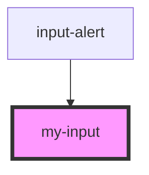

# my-input

<!-- Auto Generated Below -->

## Properties

| Property           | Attribute           | Description | Type     | Default     |
| ------------------ | ------------------- | ----------- | -------- | ----------- |
| `inputAppearance`  | `input-appearance`  |             | `string` | `undefined` |
| `inputId`          | `input-id`          |             | `string` | `undefined` |
| `inputLabel`       | `input-label`       |             | `string` | `undefined` |
| `inputPlaceholder` | `input-placeholder` |             | `string` | `undefined` |
| `inputType`        | `input-type`        |             | `string` | `'text'`    |

## Events

| Event         | Description | Type                  |
| ------------- | ----------- | --------------------- |
| `inputChange` |             | `CustomEvent<string>` |

## Dependencies

### Used by

 - [input-alert](../input-alert)

### Graph

----------------------------------------------

*Built with [StencilJS](https://stenciljs.com/)*
